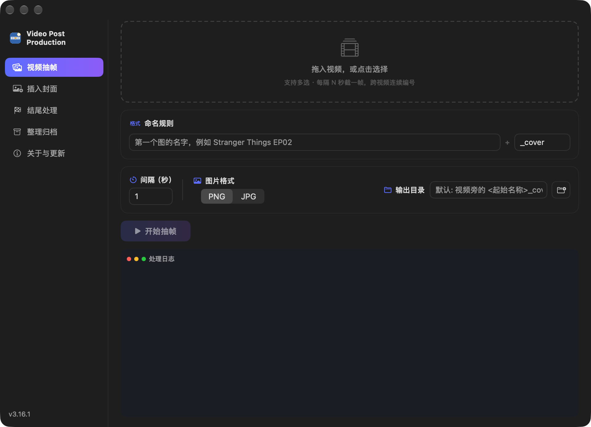
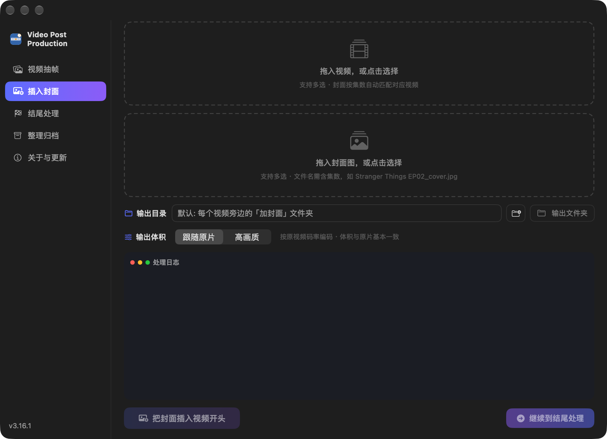
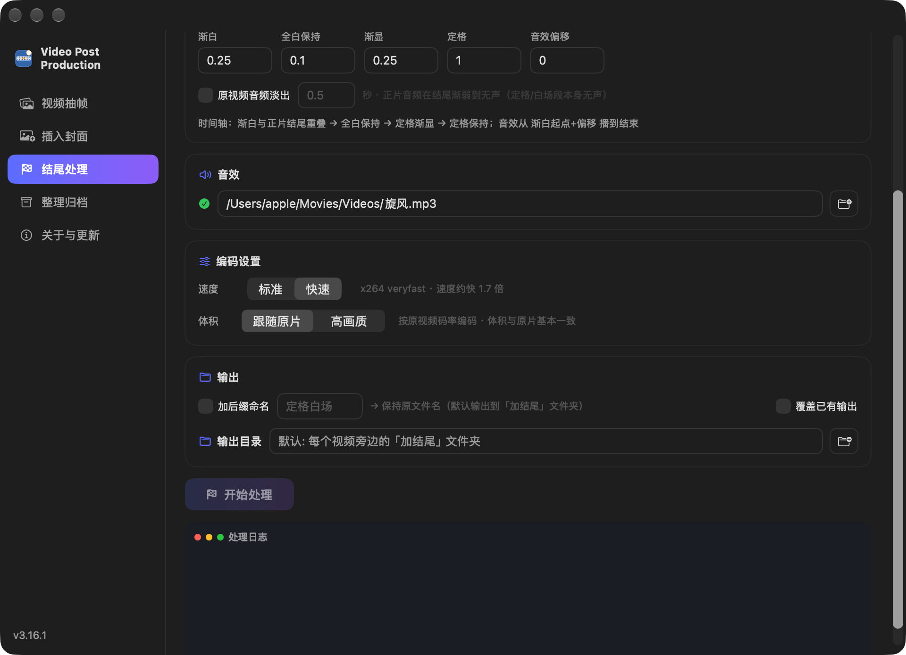
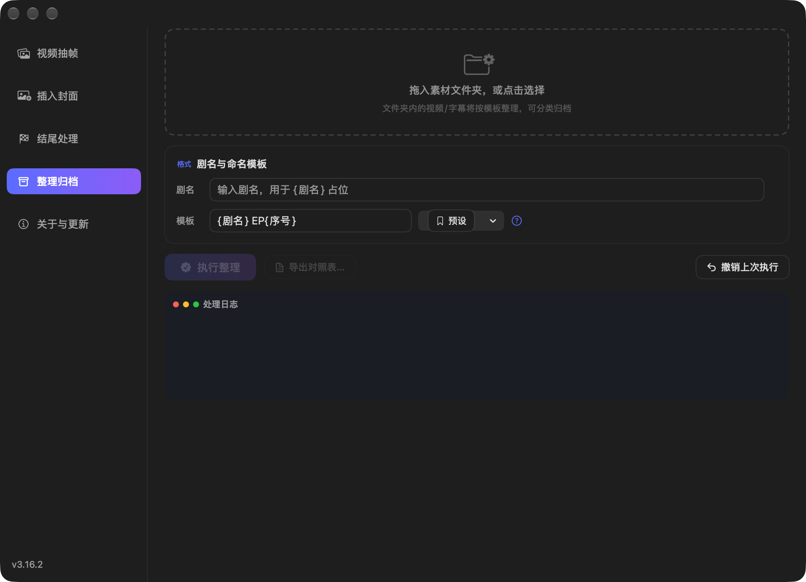
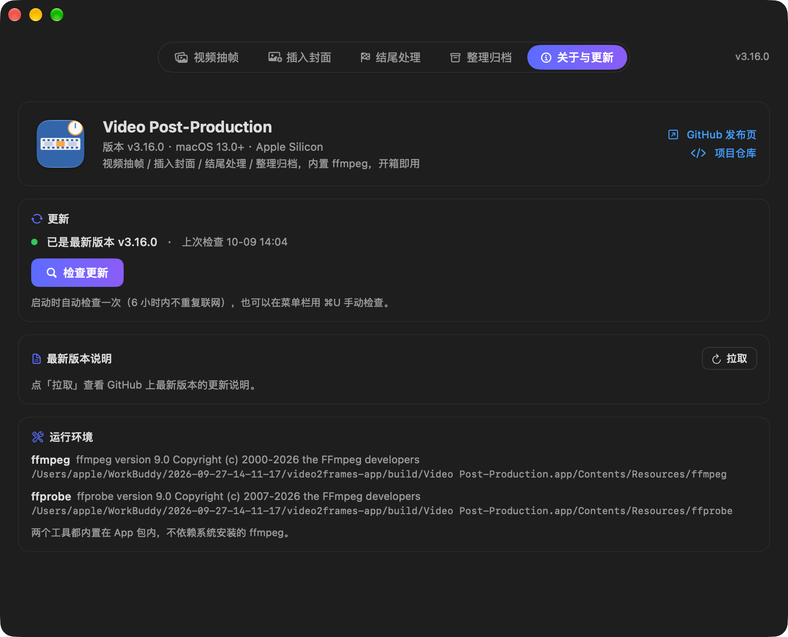

# Video Post-Production

一款为短剧/批量视频后期处理打造的 macOS 原生工具（SwiftUI + 内置 ffmpeg），把「抽帧、封面、结尾效果、整理归档」四件事装进一个 App。

  


最新版本安装包见 [Releases](https://github.com/keyisi/video-post-production/releases/latest)：`.dmg`（推荐，拖进「应用程序」）或 `.zip`，内置 ffmpeg，无需额外安装。

版本规则 `x.y.z`：新功能/大改动进 `y`（`z` 归 0，如 3.15.0），修 bug 或小调整只进 `z`（如 3.14.1）。

## 功能板块

四个板块常驻在窗口里，左上角切换 —— 切走再切回，已选文件、参数、日志、处理进度都还在。

### 0. 自动更新检查

- 启动时自动检查 GitHub Releases（6 小时内不重复联网；API 限流时自动走 `releases.atom` 兜底）
- 发现新版本：右上角出现「新版本 vX.Y.Z」提示 + 弹窗（含更新说明与安装包信息），一键打开 GitHub 下载页；可「跳过此版本」
- 手动检查：点右上角版本号，或菜单栏「检查更新…」（⌘U）

### 1. 视频抽帧



- 拖入视频（或文件夹），按设定间隔抽取帧图
- 支持自定义输出目录、PNG/JPG 格式（JPG 可调质量）、起始名称与后缀

### 2. 插入封面



- 为视频开头插入一张封面帧（单图或整个封面目录，自动按集数配对，如 EP21 ↔ 封面21）
- **集数精确匹配**：只认文件名里的集数（优先 `EP21` / `第21集`，其次取末位数字），**上层文件夹名不参与匹配** —— 视频放在「剧名31-45导出」这类目录里也不会配错；封面带 `EP31_cover` 后缀同样能认出来
- 输出体积档位：**跟随原片**（按源码率，体积约等于原片）／**高质量**（CRF 18）
- 默认输出到每个视频旁边的「加封面」文件夹
- 右下角「继续到结尾处理」按钮：一键把视频和封面带到结尾处理板块，合并成一次编码，避免二次转码

### 3. 结尾处理



结尾时间轴：**渐白 → 全白保持 → 定格渐显 → 定格保持**，可叠加：

- 🎵 音效（自动对齐到结尾段起点，可加偏移）
- 🔊 原视频音频淡出（可调时长）
- 🏷 加后缀命名，默认输出到每个视频旁边的「加结尾」文件夹
- ⚡ 编码速度档位：**快速**（veryfast，默认）／**标准**（medium，更慢更省体积）
- 📦 输出体积：**跟随原片**（默认）／**高质量**
- ⏱ 实时进度条 + 每集用时 + 总耗时/平均，处理中可随时「停止处理」（已完成的文件保留，半成品自动清理）

### 4. 整理归档



- 按模板批量重命名：`{剧名} EP{序号}` 等，支持 `{剧名} {序号} {日期} {时间} {原名} {扩展名}` 占位符
- **普通视频原地改名**（不再生成「成片」文件夹）；带 `(N)` 副本标记的归到「纯净」，字幕文件归到「字幕」
- 执行前预览改名对照、重复/冲突检测、执行后一键撤销、导出 CSV 对照表

### 5. 关于与更新



- 应用信息（版本、系统要求）+ GitHub 发布页 / 项目仓库直链
- 更新状态一目了然：当前版本、上次检查时间、手动「检查更新」、发现新版本时可直接下载或跳过
- 「最新版本说明」：一键拉取 GitHub 上最新 Release 的更新日志
- 运行环境自检：内置 ffmpeg / ffprobe 的版本与路径
- 模板不含 `{扩展名}` 时自动补全后缀，防止输出丢扩展名

## 运行要求

- macOS 13.0 及以上（Apple Silicon）
- **无需安装 ffmpeg** —— 已内置到 App 包内（静态编译版 ffmpeg 9.0 + ffprobe）

## 使用方式

- 直接双击仓库里的 `build/Video Post-Production.app`
- 或下载发布包：解压后把 App 拖进「应用程序」

> 首次打开若被 Gatekeeper 拦截：右键 → 打开；或终端执行
> `xattr -dr com.apple.quarantine "/Applications/Video Post-Production.app"`

## 从源码构建

```bash
# 编译 GUI App（注意：可执行文件名为 VideoFrameTool，不是 App 显示名）
swiftc -disable-sandbox -O -parse-as-library Logic.swift App.swift \
  -o "build/Video Post-Production.app/Contents/MacOS/VideoFrameTool"
codesign --force -s - "build/Video Post-Production.app"

# 或编译命令行版
swiftc -disable-sandbox -O main.swift Logic.swift -o build/videopost-cli
```

### 命令行示例

```bash
# 结尾处理（含音效 + 音频淡出 + 封面一次编码，快速档、体积跟随原片）
./videopost-cli --ending 视频/ --cover 封面/ --sfx 音效.m4a \
  --afade 1.0 --hold 1.0 --fade-in 0.25 --freeze 1.0 \
  --suffix 结尾 --speed fast --size match --out 输出/

# 整理归档（按模板重命名；普通视频原地改名，副本→纯净、字幕→字幕夹）
./videopost-cli --cli 视频目录/ 剧名 --template "{剧名} EP{序号}" --organize --execute

# 撤销上次整理
./videopost-cli --undo
```

## 项目结构

```
├── App.swift        # SwiftUI 界面（四大板块 + 通用组件）
├── Logic.swift      # 引擎：抽帧/封面/结尾(EndingEngine)/整理(DramaOrganizer)
├── main.swift       # CLI 入口与路由
├── screenshots/     # 四个板块的界面截图
├── 调试记录.md       # 每次排查/修复的归档（现象→根因→修复→验证）
└── build/           # 现成的 App（内置 ffmpeg / ffprobe）
```

每次修 bug 都会同步写入 `调试记录.md`（含环境/工具链踩坑与「改了没生效」排查清单）。

## 设计说明

- 四个板块用 `ZStack` 常驻视图树，切换只改 `opacity / allowsHitTesting`，不销毁 View，因此 `@State` 内容不丢；非当前板块还会 `offset` 移出可视区，避免隐藏层抢占拖放落点
- 封面配对用 `episodeNumber(in:)`：**只解析文件名**（不看上层目录，避免「31-45导出」这类文件夹名污染集数），优先 `EPxx / 第N集` 标记，其次剔除 `(1)` 副本标记与分辨率/年份后取末位数字，最后做**集数精确相等**匹配
- 设置通过 `@AppStorage`（UserDefaults，键前缀 `fxt_`）持久化，重开 App 自动恢复
- 内置 ffmpeg 定位优先级：App 包内 Resources → `~/.local/bin` → `/opt/homebrew/bin` 等系统路径
- 进度来自 ffmpeg `-progress pipe:1` 的 `out_time_us` 实时解析，不是估算
- 更新检查走 GitHub API `/releases/latest`，被限流时降级到 `releases.atom`；版本号逐段数字比较，发现新版写入 `@AppStorage`（`fxt_newVersion`），跨重启仍显示提示
- 停止处理通过全局 `RunControl` 终止进程（`terminate` + 0.5s 后 `SIGKILL` 兜底）
- 重命名防呆护栏：模板不含 `{扩展名}` 时自动补全；计划内重名目标会被标红并阻止执行
